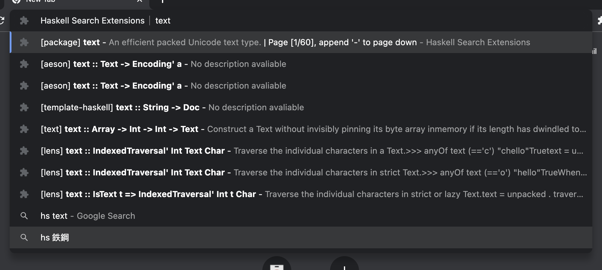

# Haskell Search Extension

*DON'T USE, UNDER DEVELOPMENT*

A browser extension to search Haskell words.

## Supporting Status

- [x] Search hackage packages.
- [x] Search hackage functions.
- [ ] Search hackage signatures. (Long way to go, respect Neil more...)

## Acknowledge

- Basic core search are based on [search-extension-core](https://github.com/huhu/search-extension-core) and transfered to TypeScript by me(@July541).
- Extension is implemented by referring [cpp-search-extension](https://github.com/huhu/cpp-search-extension).
- Implementing build from ts to js with the help of [web-ext-react-template](https://github.com/hiterm/web-ext-react-template)
